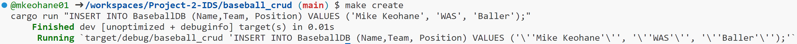
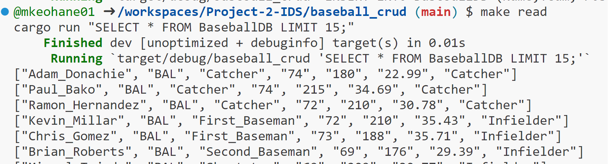
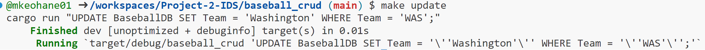
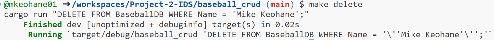

# Individual Project 2 - Rust CLI CRUD Operations

[](https://github.com/mkeohane01/Project-2-IDS/actions/workflows/main.yml)

## Explanation of the project:
 - This project contains code working with a Baseball SQLite database using RUST CLI and DevOps priciples.
 - Uses Alfredo Deza's rust template
 - The script contained in baseball_crud allows users to query the BaseballDB database from the command line interface.
 - The use of Github Copilot helped me write the code for this project. While it only knew how to code using an older version of rusqlite, it was able to help me put my thoughts in to Rust.
    - I have done similar projects in python and Copilot helped me learn and implement Rust syntax to connect to and query a database.
- Video Explination of project: [here](https://duke.zoom.us/rec/share/DLH7aG0oUzv3wiDXINxdeiTWEGOXWYy5mlDx-RjXuH4MaOZoIetl5Z70_SDLpAaI.V9dj4sWs_pwoltlI)

## How to run the program:
- First move to the baseball_crud directory.
    - ```cd baseball_crud```
- To see all of the options offered in the make file:
    - ```Make help```
- Use cargo to build
    - ```cargo buid```
- Use cargo to run the script after building with the specified query for the BaseballDB database.
    - ```cargo run -- "<SQL Query>"```

### CRUD Operations
- Example specific queries to show crud operations were implemented in the make file
    - ```make create```
        - 
    - ```make read```
        - 
    - ```make update```
        - 
    - ```make delete```
        - 

## Dependencies
-   rusqlite = "0.25.0"
    - Download handled through cargo and repo can be found [here](https://github.com/rusqlite/rusqlite)
- SQLite
    - Database management platform used for this application
    - Downloads for your specific platform can be found [here](https://www.sqlite.org/download.html)
